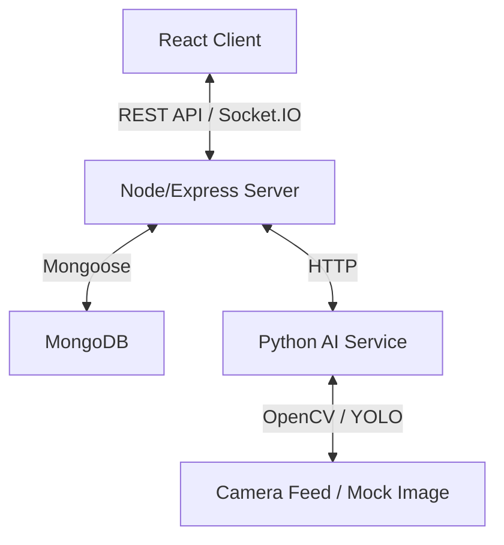

# PARKAI: Full-Stack AI Smart Parking Management System

PARKAI is a hackathon-ready intelligent parking management system designed to optimize parking lot utilisation, calculate dynamic parking prices in real-time, locator and forecast EV charger load, and secure municipal emergency egress paths. 

The system leverages a React frontend, Node.js + Express backend, MongoDB database, real-time WebSocket communication, and a mock Python computer vision service.

---

## 1. System Architecture



### Key Business & Social Value
- **Space Optimization:** Guides drivers directly to compatible slots, increasing turnover and decreasing city congestion.
- **Dynamic Pricing:** Automatically adjusts rates based on occupancy scales and peak traffic hours.
- **First Responder Protection:** Operator-driven "Emergency Corridor Mode" instantly secures egress lines (e.g. fire escapes) and flags occupied cars.
- **Faster EV Adoption:** Locates and schedules EV charging ports with 24h demand forecaster curves.
- **No Eco Scoring:** Explicitly focuses on raw operational metrics, avoiding user environmental/eco-point leaderboards.

---

## 2. Technology Stack
- **Frontend:** React.js, Vite, Vanilla CSS (Premium dark mode UI, glassmorphism), Recharts, Lucide Icons, Socket.IO client.
- **Backend:** Node.js, Express, Socket.IO, JWT, bcryptjs, Mongoose.
- **Database:** MongoDB (Local or MongoDB Atlas).
- **AI Service:** Python, FastAPI, OpenCV, NumPy, Uvicorn.

---

## 3. Project Directory Structure

```
smart-parking-system/
│
├── client/                      # React frontend
│   ├── src/
│   │   ├── components/          # Reusable UI elements (Navbar, ParkingMap, SlotCard, Charts)
│   │   ├── context/             # AuthContext (state, JWTs, WebSockets)
│   │   ├── pages/               # Dashboards, Finder, Vehicles, EV Charging, Override gates
│   │   ├── services/            # API queries layer & WebSocket client
│   │   ├── App.jsx              # Tab router
│   │   └── main.jsx             # React entry point
│   ├── package.json
│   └── vite.config.js
│
├── server/                      # Express backend
│   ├── config/                  # Database connections
│   ├── controllers/             # Business controllers (Auth, Parking, Session, pricing)
│   ├── middleware/              # JWT auth and roles guards
│   ├── models/                  # 10 Mongoose database schemas
│   ├── routes/                  # Express routes
│   ├── services/                # Algorithms (Recommendation engine, dynamic pricing)
│   ├── .env                     # Development configurations
│   ├── seed.js                  # Database seeder
│   ├── server.js                # Server entry point
│   └── package.json
│
├── ai-service/                  # Python OpenCV simulator
│   ├── app.py                   # FastAPI image segmentor
│   └── requirements.txt         # Pip libraries list
│
├── .env.example                 # Root configuration guide
└── README.md                    # Core project documentation
```

---

## 4. Environment Variables Setup

Create a `.env` file inside the `server/` directory (or copy from `.env.example` in the root).

```env
PORT=5000
NODE_ENV=development
MONGODB_URI=mongodb://127.0.0.1:27017/smart-parking-system
JWT_SECRET=jwt_parking_secret_key_123456
AI_SERVICE_URL=http://127.0.0.1:8000
```

---

## 5. Quick Start Installation (VS Code Shell)

Follow these steps to run the complete prototype:

### Step 1: Install Dependencies
Open three terminal splits in VS Code and run the following:

**Terminal 1 (Backend):**
```bash
cd server
npm install
```

**Terminal 2 (Frontend):**
```bash
cd client
npm install
```

**Terminal 3 (AI Service):**
```bash
cd ai-service
pip install -r requirements.txt
```

---

### Step 2: Seed the MongoDB Database
Ensure your local MongoDB service is running (on `mongodb://localhost:27017`), then run the seeder inside the `server` directory:

```bash
cd server
node seed.js
```

---

### Step 3: Run the Application Servers

**Terminal 1 (Backend):**
```bash
cd server
node server.js
```
*Starts Express + Socket.IO server on [http://localhost:5000](http://localhost:5000)*

**Terminal 2 (Frontend):**
```bash
cd client
npm run dev
```
*Starts Vite server on [http://localhost:5173](http://localhost:5173)*

**Terminal 3 (AI Python Service):**
```bashhttp
cd ai-service
python app.py
```
*Starts FastAPI server on [http://localhost:8000](http://localhost:8000)*

---

## 6. Hackathon Demo flow & Credentials

We have pre-seeded test accounts. Open [://localhost:5173](http://localhost:5173) and sign in using:

### Demo User Accounts

| Role | Email | Password | What to test |
|---|---|---|---|
| **Regular/EV Driver** | `john@parking.com` | `user123` | Reserve slots, get AI recommendations, view pricing, check-in, EV charging |
| **System Operator (Admin)** | `admin@parking.com` | `admin123` | Occupancy stats, live revenue line charts, toggle Emergency Mode, override slots |

### Interactive Demo Walkthrough
1. **Login** as driver `john@parking.com`.
2. View **Active Parking Ticket** (currently empty).
3. Go to **My Vehicles** to view registered vehicles.
4. Go to **Find Parking**, chooseMH-12-AB-1234, and click **Find Best Slot (AI)**.
5. System runs the recommendation scoring formula and highlights the optimal slot (with text justification) and 2-3 alternatives.
6. Click **Reserve Slot Now** to book it.
7. Logout and **Login** as admin `admin@parking.com`.
8. Check **Admin Dashboard** and see that total revenue, occupancy %, and booked slot counts update instantly via WebSockets.
9. Go to **Emergency Mode** page, select facility, and click **ACTIVATE EMERGENCY CORRIDOR**.
10. Open a second browser tab logged in as `john@parking.com`. You will instantly receive a glowing evacuation alert banner, and Slots B-01 to B-08 will pulse red on the driver's map. Booking requests on these slots will fail.
11. Admin can go to **Parking Map** tab, select a slot, and click **Simulate Vehicle Arrival** to mock loop sensors.
12. Admin can visit **Violations** tab, click **Trigger Random Infraction** to simulate computer vision alerts, and resolve active fines.

---

## 7. Express API Specifications

### Authentication
- `POST /api/auth/register` - Register a new driver or operator account.
- `POST /api/auth/login` - Login, returns JWT token.

### Vehicles (JWT Protected)
- `GET /api/vehicles` - List user's garage.
- `POST /api/vehicles` - Add new vehicle.
- `DELETE /api/vehicles/:id` - Delete vehicle.

### Parking & AI (JWT Protected)
- `GET /api/parking` - List all facilities.
- `GET /api/parking/:facilityId/slots` - Fetch slot state maps and dynamic pricing values.
- `GET /api/parking/:facilityId/recommend` - Query AI recommendation engine for the best slot.

### Sessions & Reservations (JWT Protected)
- `POST /api/reservations` - Book slot (runs overlap timing validations).
- `PUT /api/reservations/:id/cancel` - Cancel booking.
- `POST /api/sessions/start` - Check-in vehicle (sets slot status to `Occupied`).
- `POST /api/sessions/end` - Check-out vehicle (calculates duration and collects fees).

### Admin Controls (Admin Role Protected)
- `GET /api/admin/dashboard` - Live stats (occupancy rate, active parkers, totals).
- `GET /api/admin/analytics` - Revenue line charts, peak distributions, violation charts.
- `PUT /api/admin/pricing` - Modify pricing multipliers.
- `PUT /api/admin/emergency-mode` - Toggle emergency corridor.
- `PUT /api/admin/slots/:id` - Override slot states.
- `POST /api/admin/slots/:id/simulate-arrival` - Simulate hardware loops.
